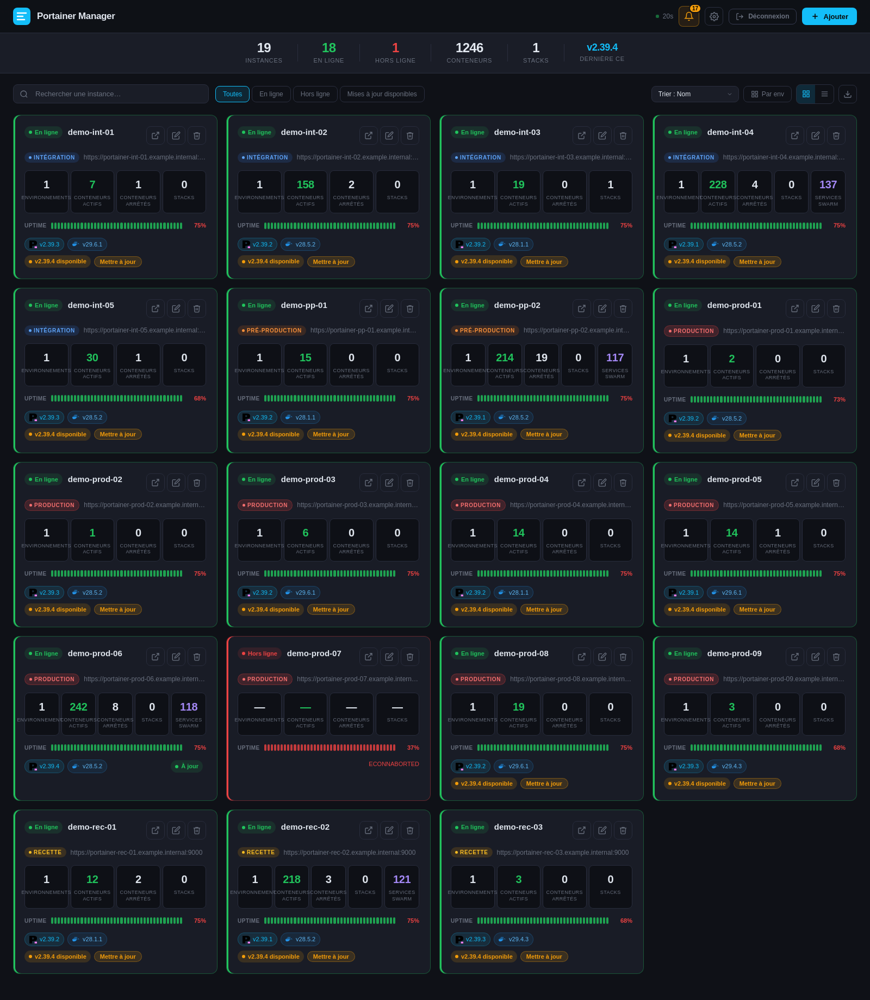
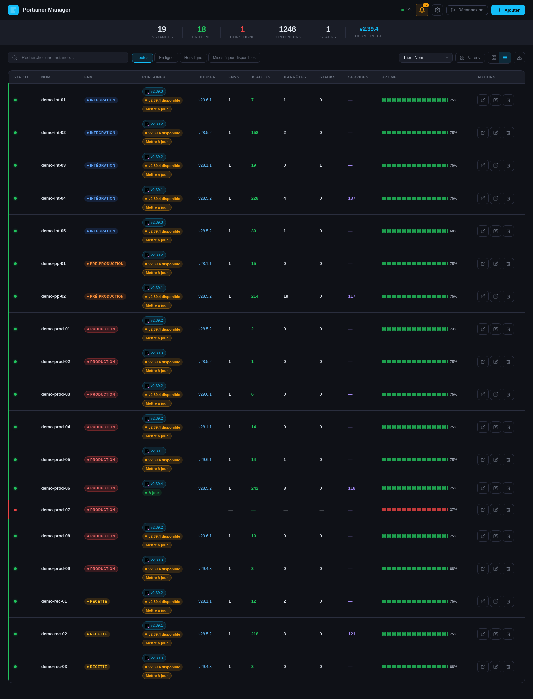
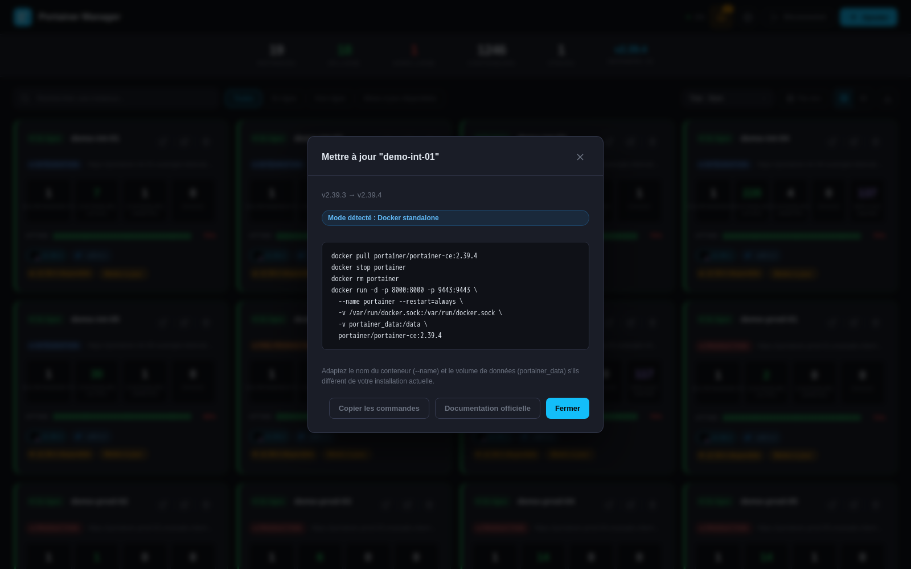
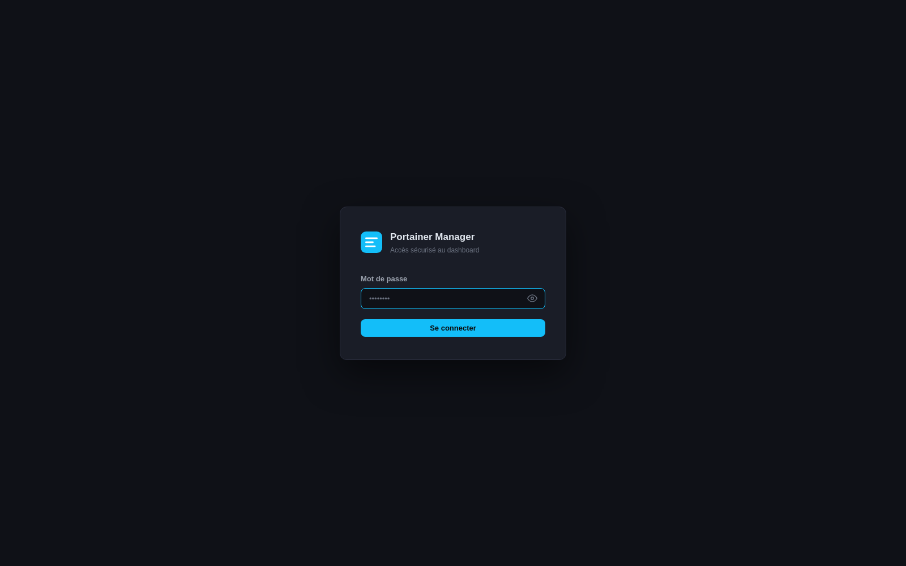

# Portainer Manager

Dashboard web sécurisé pour gérer plusieurs instances Portainer depuis une interface unique.

## Aperçu

> Noms et URLs anonymisés dans ces captures — l'interface réelle affiche vos propres instances.

**Vue grille**


**Vue liste**


**Guide de mise à jour**


**Connexion**


## Fonctionnalités

### Dashboard
- Stats globales : instances totales, en ligne, hors ligne, conteneurs, stacks, dernière version CE
- **Alerte cloche** : liste des instances Portainer à mettre à jour, triées de la plus ancienne version à la plus récente
- **Auto-refresh** toutes les 30 secondes avec compte à rebours visible

### Gestion des instances
- **Ajout** via URL + API Token uniquement (pas de login/mot de passe Portainer)
- **Modification** : nom, URL, token, environnement, notes
- **Suppression** avec confirmation
- **Bouton "Ouvrir"** pour accéder directement à l'instance Portainer

### Cards
- Statut en ligne / hors ligne avec bordure colorée (vert/rouge)
- Badge d'**environnement** coloré : Intégration, Recette, Pré-production, Production
- Métriques : environnements, conteneurs actifs/arrêtés, stacks, services Swarm
- Versions **Portainer** et **Docker** avec logos
- Badge **"À jour"** ou **"vX.X.X disponible"** par comparaison avec la dernière CE
- Bouton **"Mettre à jour"** sur les instances obsolètes : ouvre une popup avec les commandes adaptées (Docker standalone ou Swarm, détecté automatiquement)
- **Notes** libres affichées sur la card
- **Uptime sparkline** : historique des 288 dernières vérifications (~2.4h) avec pourcentage

### Vues et navigation
- **Vue grille** (défaut) ou **vue liste** (tableau dense)
- **Groupement par environnement** : sections Production / Preprod / Recette / Intégration
- **Tri** : par nom, environnement, statut, version, date d'ajout
- **Recherche** par nom ou URL
- **Filtre** : Toutes / En ligne / Hors ligne / Mises à jour disponibles
- **Export CSV** de l'état complet du parc

### Alertes webhook
- Notification automatique quand une instance change de statut (online ↔ offline)
- Support : **Slack**, **Microsoft Teams**, **Generic JSON**
- Bouton "Tester" dans les paramètres

### Sécurité
- **Authentification** par mot de passe avec session 8h, persistée sur disque (`data/sessions/`) : un redémarrage du conteneur ne déconnecte pas les sessions actives
- **Tokens API chiffrés au repos** (AES-256-GCM, clé dérivée de `SESSION_SECRET`) dans `data/instances.json`
- Les tokens API ne sont **jamais** transmis au navigateur
- Les appels vers l'API Portainer sont effectués côté serveur uniquement
- Certificats TLS auto-signés acceptés (fréquent en local)

---

## Prérequis

- **Docker** (recommandé) — l'image utilise `node:24-alpine` (dernière LTS active)
- **ou** Node.js 18+ en local (minimum imposé par Express 5)

---

## Démarrage rapide

### Avec Docker (recommandé)

```bash
# Copier et configurer les variables
cp .env.example .env   # ou éditer .env directement

docker compose up -d
```

### En local (Node.js)

```bash
npm install
npm start
```

Pour le développement avec rechargement automatique :

```bash
npm run dev
```

L'application est accessible sur **http://localhost:3000** (ou l'IP définie dans `HOST_IP`).

---

## Configuration — fichier `.env`

| Variable         | Défaut                        | Description                              |
|------------------|-------------------------------|------------------------------------------|
| `PORT`           | `3000`                        | Port d'écoute du serveur                 |
| `HOST_IP`        | *(toutes les interfaces)*     | IP affichée au démarrage dans les logs   |
| `ADMIN_PASSWORD` | `admin`                       | ⚠️ Mot de passe du dashboard — à changer |
| `SESSION_SECRET` | *(aléatoire à chaque restart)*| Clé de signature des sessions et de chiffrement des tokens API |

> **Important** : sans `SESSION_SECRET` fixe, les sessions sont invalidées **et les tokens API chiffrés deviennent illisibles** à chaque redémarrage.

Exemple de `.env` :

```env
HOST_IP=192.168.1.100
ADMIN_PASSWORD=MonMotDePasseSecurisé
SESSION_SECRET=une-chaine-aleatoire-longue-et-unique
PORT=3000
```

---

## Mettre l'application derrière un reverse proxy

L'app écoute en HTTP simple sur le port interne défini par `PORT` (3000 par défaut), exposé côté hôte via le mapping défini dans `docker-compose.yml` (ex. `127.0.0.1:3001:3000`). Un reverse proxy permet d'ajouter un nom de domaine et le TLS/HTTPS devant.

Dans tous les cas :
- Adaptez `proxy_pass` / `reverse_proxy` au port réellement exposé côté hôte (celui de `ports:` dans `docker-compose.yml`, pas forcément 3000).
- Le cookie de session n'est pas marqué `Secure`, donc il fonctionne tel quel derrière un proxy qui termine le TLS (le trajet proxy → app reste en HTTP interne). Pas de configuration supplémentaire côté app nécessaire.
- Pensez à garder `SESSION_SECRET` fixe dans `.env` (voir plus haut).

### Nginx

```nginx
server {
    listen 443 ssl;
    server_name portainer-manager.example.com;

    ssl_certificate     /etc/letsencrypt/live/portainer-manager.example.com/fullchain.pem;
    ssl_certificate_key /etc/letsencrypt/live/portainer-manager.example.com/privkey.pem;

    location / {
        proxy_pass http://127.0.0.1:3001;
        proxy_set_header Host              $host;
        proxy_set_header X-Real-IP         $remote_addr;
        proxy_set_header X-Forwarded-For   $proxy_add_x_forwarded_for;
        proxy_set_header X-Forwarded-Proto $scheme;
    }
}
```

### Caddy

Le TLS est géré automatiquement (Let's Encrypt) — pas de config manuelle des certificats.

```caddyfile
portainer-manager.example.com {
    reverse_proxy 127.0.0.1:3001
}
```

### Traefik

Si Traefik tourne déjà via Docker sur le même hôte, ajoutez ces labels au service dans `docker-compose.yml` (et retirez le mapping `ports:` si Traefik doit être le seul point d'entrée) :

```yaml
services:
  portainer-manager:
    # ... reste de la config inchangé ...
    labels:
      - "traefik.enable=true"
      - "traefik.http.routers.portainer-manager.rule=Host(`portainer-manager.example.com`)"
      - "traefik.http.routers.portainer-manager.entrypoints=websecure"
      - "traefik.http.routers.portainer-manager.tls.certresolver=letsencrypt"
      - "traefik.http.services.portainer-manager.loadbalancer.server.port=3000"
    networks:
      - traefik-public

networks:
  traefik-public:
    external: true
```

### Apache

Nécessite les modules `proxy` et `proxy_http` (`a2enmod proxy proxy_http` puis reload).

```apache
<VirtualHost *:443>
    ServerName portainer-manager.example.com

    SSLEngine on
    SSLCertificateFile      /etc/letsencrypt/live/portainer-manager.example.com/fullchain.pem
    SSLCertificateKeyFile   /etc/letsencrypt/live/portainer-manager.example.com/privkey.pem

    ProxyPreserveHost On
    ProxyPass        / http://127.0.0.1:3001/
    ProxyPassReverse / http://127.0.0.1:3001/
    RequestHeader set X-Forwarded-Proto "https"
</VirtualHost>
```

---

## Créer un API Token Portainer

1. Connectez-vous à votre instance Portainer
2. Cliquez sur votre nom d'utilisateur en haut à droite → **Mon compte**
3. Section **Access tokens** → **Add access token**
4. Donnez un nom, copiez le token généré (format `ptr_…`)

---

## Structure du projet

```
portainer-manager/
├── server.js              # Backend Express (API, proxy Portainer, auth, webhook, uptime)
├── package.json
├── Dockerfile
├── docker-compose.yml
├── .env                   # Variables d'environnement (ne pas committer)
├── data/
│   ├── instances.json     # Instances sauvegardées, tokens chiffrés (créé automatiquement)
│   ├── config.json        # Config webhook (créé automatiquement)
│   ├── uptime.json        # Historique uptime (créé automatiquement)
│   └── sessions/          # Sessions persistées sur disque (créé automatiquement)
└── public/
    ├── index.html         # Dashboard principal
    ├── login.html         # Page de connexion
    ├── style.css
    └── app.js
```

---

## API REST

### Auth
| Méthode | Route                  | Description                      |
|---------|------------------------|----------------------------------|
| POST    | `/api/auth/login`      | Connexion `{password}`           |
| POST    | `/api/auth/logout`     | Déconnexion                      |

### Instances
| Méthode | Route                        | Description                                        |
|---------|------------------------------|----------------------------------------------------|
| GET     | `/api/instances`             | Liste toutes les instances (sans token)            |
| POST    | `/api/instances`             | Ajouter `{name, url, token, environment, notes}`   |
| PUT     | `/api/instances/:id`         | Modifier `{name, url, token, environment, notes}`  |
| DELETE  | `/api/instances/:id`         | Supprimer une instance                             |
| GET     | `/api/instances/:id/data`    | Données live depuis l'API Portainer                |

### Divers
| Méthode | Route                          | Description                            |
|---------|--------------------------------|----------------------------------------|
| GET     | `/api/uptime`                  | Historique uptime par instance         |
| GET     | `/api/config`                  | Configuration webhook                  |
| PUT     | `/api/config`                  | Modifier la config webhook             |
| POST    | `/api/config/test-webhook`     | Tester un webhook                      |
| GET     | `/api/portainer/latest-version`| Dernière version CE (cache 1h)         |
