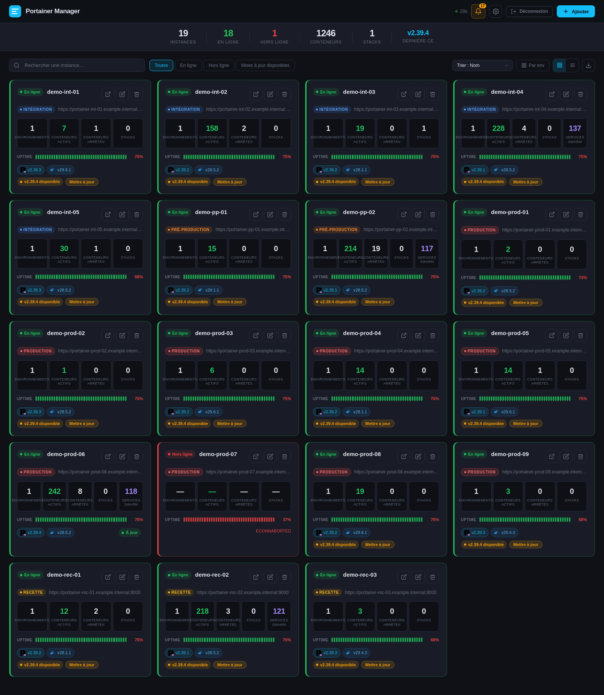
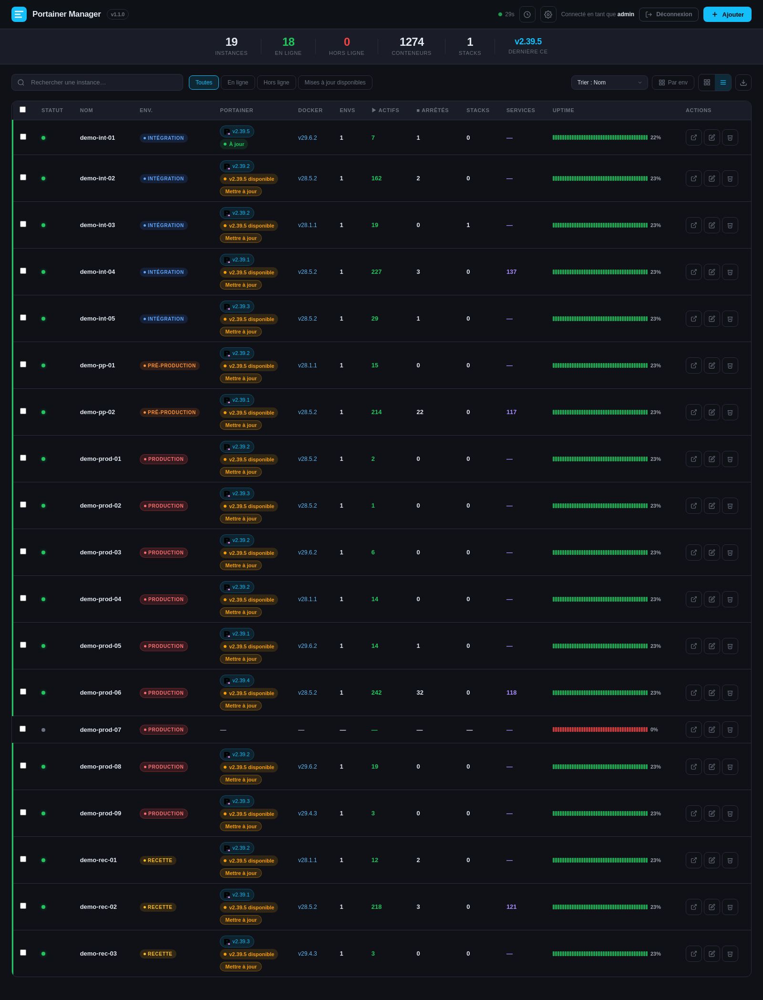
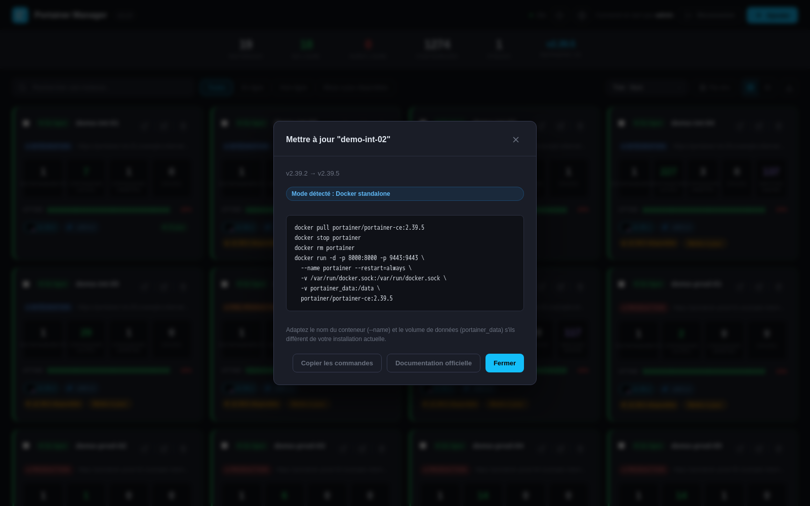
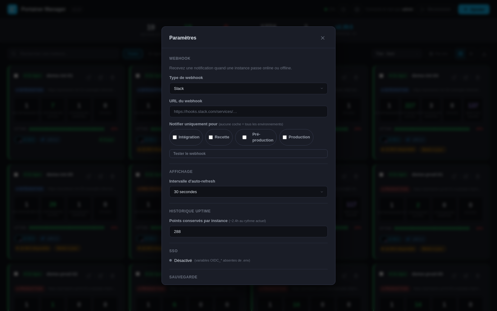
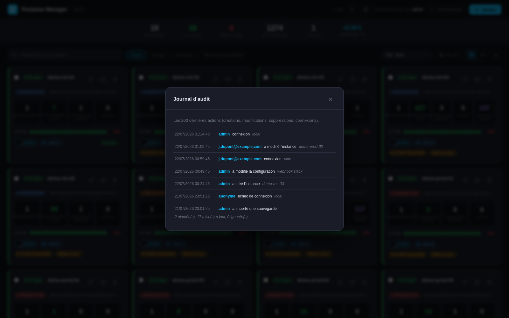
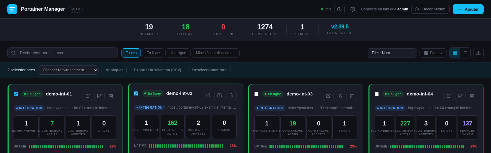
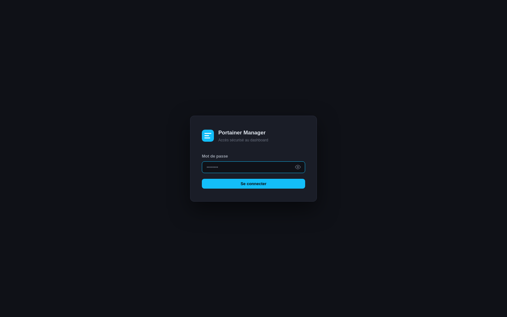

# Portainer Manager

[](https://github.com/ThePharaohOps/portainer-manager/tags)
[](LICENSE)
[](Dockerfile)

🇫🇷 [Lire en français](README.fr.md)

Secure web dashboard for managing multiple Portainer instances from a single interface.

> **Note**: this documentation is available in English and French, but the application's own interface is currently **French-only** (no i18n yet) — see the screenshots below for exactly what you'll see on screen.

## Overview

> Names and URLs are anonymized in these screenshots — the real interface shows your own instances.

**Grid view**


**List view**


**Update guide**


**Settings**


**Audit log**


**Bulk actions**


**Login**


## Features

### Dashboard
- Global stats: total instances, online, offline, containers, stacks, latest CE version
- **Alert bell**: list of Portainer instances that need updating, sorted from oldest to newest version
- **Auto-refresh** every 30 seconds with a visible countdown

### Instance management
- **Add** via URL + API token only (no Portainer login/password)
- **Edit**: name, URL, token, environment, notes
- **Delete** with confirmation
- **"Open" button** to jump straight to the Portainer instance

### Cards
- Online / offline status with a colored border (green/red)
- Colored **environment** badge: Intégration, Recette, Pré-production, Production *(these four labels are currently French-only in the UI — see note above)*
- Metrics: environments, running/stopped containers, stacks, Swarm services
- **Portainer** and **Docker** versions with logos
- **"Up to date"** or **"vX.X.X available"** badge, compared against the latest CE release
- **"Update"** button on outdated instances: opens a popup with the right commands (Docker standalone or Swarm, auto-detected)
- Free-text **notes** shown on the card
- **Uptime sparkline**: history of the last 288 checks (~2.4h) with a percentage

### Views and navigation
- **Grid view** (default) or **list view** (dense table)
- **Group by environment**: Production / Pré-production / Recette / Intégration sections
- **Sort**: by name, environment, status, version, date added
- **Search** by name or URL
- **Global search** (🔍 icon): find a container or a stack by name **across every instance**, results grouped by instance with a direct link to Portainer — see [Global search](#global-search)
- **Filter**: All / Online / Offline / Updates available
- **CSV export** of the whole fleet's state
- **Bulk actions** (admin): select multiple instances to change their environment in bulk or export only the selection to CSV

### Roles and audit
- Optional **read-only role (viewer)** via an OIDC claim/group: hides Add/Edit/Delete, Settings, Audit and bulk actions — see [Admin/viewer roles (OIDC)](#adminviewer-roles-oidc)
- **Audit log** (admin): history of instance creations/edits/deletions, configuration changes, backup imports and logins — who did what, and when
- **Public status page**, read-only and unauthenticated (`/status`): only the count of online/offline instances, no sensitive detail — handy for a wall display
- **Prometheus endpoint** (`/metrics`): status, running/stopped containers, stacks, uptime and update availability per instance, in Prometheus exposition format — see [Prometheus endpoint](#prometheus-endpoint)

### Webhook alerts
- Automatic notification when an instance changes status (online ↔ offline)
- Supports: **Slack**, **Microsoft Teams**, **Generic JSON**
- **Filter by environment**: only notify for Production, for example (no checkbox ticked = all)
- "Test" button in settings

### Settings (⚙️ button)
- **Webhook**: type, URL, environment filter, test
- **Display**: auto-refresh interval (15s / 30s / 1min / 5min)
- **Uptime history**: number of points kept per instance (replaces the old fixed constant of 288)
- **SSO status**: enabled/disabled, provider, quick test link
- **Backup**: export/import the full configuration as JSON (instances + encrypted tokens + settings) — see [Backup and restore](#backup-and-restore)

### Security
- **Authentication** via a shared password, with an 8h session persisted to disk (`data/sessions/`): restarting the container doesn't log active sessions out
- Optional **SSO / OIDC** (Azure AD/Entra ID, Okta, Keycloak, Google Workspace, Authentik...): layers on top of the local password, which always stays available as a fallback — see [Configure SSO (OIDC)](#configure-sso-oidc)
- **API tokens encrypted at rest** (AES-256-GCM, key derived from `SESSION_SECRET`) in `data/instances.json`
- API tokens are **never** sent to the browser
- Calls to the Portainer API are made server-side only
- Self-signed TLS certificates are accepted (common in local setups)

---

## Prerequisites

- **Docker** (recommended) — the image uses `node:24-alpine` (latest active LTS) and ships a `HEALTHCHECK` (`docker ps` reflects the app's real state, useful behind Swarm/Kubernetes/Traefik)
- **or** Node.js 18+ locally (minimum required by Express 5)

---

## Quick start

### With Docker (recommended)

```bash
# Copy and configure the variables
cp .env.example .env   # or edit .env directly

docker compose up -d
```

### Locally (Node.js)

```bash
npm install
npm start
```

For development with hot reload:

```bash
npm run dev
```

The app is available at **http://localhost:3000** (or the IP set in `HOST_IP`).

---

## Configuration — `.env` file

| Variable         | Default                        | Description                              |
|------------------|---------------------------------|-------------------------------------------|
| `PORT`           | `3000`                          | Server listen port                        |
| `HOST_IP`        | *(all interfaces)*              | IP shown in the startup logs              |
| `ADMIN_PASSWORD` | `admin`                         | ⚠️ Dashboard password — change this       |
| `SESSION_SECRET` | *(random on every restart)*     | Key used to sign sessions and encrypt API tokens |

> **Important**: without a fixed `SESSION_SECRET`, sessions are invalidated **and encrypted API tokens become unreadable** on every restart.

Example `.env`:

```env
HOST_IP=192.168.1.100
ADMIN_PASSWORD=MySecurePassword
SESSION_SECRET=a-long-random-unique-string
PORT=3000
```

---

## Configure SSO (OIDC)

In addition to the shared password, the app can delegate authentication to any **OpenID Connect** provider (Azure AD/Entra ID, Okta, Keycloak, Google Workspace, Authentik, etc.) via `openid-client`. The local password **always stays active** as a fallback, even when SSO is configured.

| Variable                | Default                | Description                                                        |
|--------------------------|--------------------------|------------------------------------------------------------------------|
| `OIDC_ISSUER_URL`         | *(disabled if empty)*   | OIDC issuer URL (discovered via `/.well-known/openid-configuration`) |
| `OIDC_CLIENT_ID`          |                          | Client ID registered with the provider                             |
| `OIDC_CLIENT_SECRET`      |                          | Matching client secret                                              |
| `OIDC_REDIRECT_URI`       |                          | Callback URL, must **exactly** match the one registered with the provider (e.g. `https://portainer-manager.example.com/auth/oidc/callback`) |
| `OIDC_SCOPE`              | `openid profile email`  | Requested scopes                                                    |
| `OIDC_DISPLAY_NAME`       | `SSO`                    | Button label on the login page (e.g. `Entra ID`, `Okta`)            |
| `OIDC_ALLOW_INSECURE`     | `false`                  | `true` to allow an HTTP issuer or a self-signed certificate — **dev/test only**, never in production |

The three variables `OIDC_ISSUER_URL`, `OIDC_CLIENT_ID` and `OIDC_CLIENT_SECRET` (+ `OIDC_REDIRECT_URI`) are **all required** to enable SSO; if any is missing, only the local password is offered.

### Example — Keycloak
```env
OIDC_ISSUER_URL=https://keycloak.example.com/realms/my-realm
OIDC_CLIENT_ID=portainer-manager
OIDC_CLIENT_SECRET=xxxxxxxx
OIDC_REDIRECT_URI=https://portainer-manager.example.com/auth/oidc/callback
OIDC_DISPLAY_NAME=Keycloak
```

### Example — Azure AD / Entra ID
```env
OIDC_ISSUER_URL=https://login.microsoftonline.com/<tenant-id>/v2.0
OIDC_CLIENT_ID=xxxxxxxx-xxxx-xxxx-xxxx-xxxxxxxxxxxx
OIDC_CLIENT_SECRET=xxxxxxxx
OIDC_REDIRECT_URI=https://portainer-manager.example.com/auth/oidc/callback
OIDC_DISPLAY_NAME=Entra ID
```

In both cases, `OIDC_REDIRECT_URI` must be declared as an authorized redirect URI on the provider's side (type "Web"/"Authorization Code").

> Behind a reverse proxy, the exact value of `OIDC_REDIRECT_URI` is always used for the code exchange (regardless of what `Host` header the proxy forwards) — no need to configure `trust proxy` for SSO to work. If you still get `invalid_grant` / "Incorrect redirect_uri" (Keycloak) or the equivalent elsewhere, first check that `OIDC_REDIRECT_URI` matches the URI registered with the provider **character for character**.

> **Why not LDAP?** The only viable LDAP library for Node.js (`ldapjs`, and everything that depends on it such as `passport-ldapauth`) was [officially decommissioned](https://github.com/ldapjs/node-ldapjs) by its maintainer, with no maintained successor. OIDC is favored instead because it's actively maintained and covers nearly every modern enterprise directory (including Active Directory via ADFS or Entra ID).

---

## Admin/viewer roles (OIDC)

By default, any authenticated user (local password or SSO) gets full (**admin**) access. SSO users can be restricted to a **viewer** (read-only) role based on a claim/group returned by the OIDC provider. The local password account always stays **admin**, regardless of this setting.

| Variable            | Default    | Description                                                                 |
|---------------------|------------|--------------------------------------------------------------------------------|
| `OIDC_ROLE_CLAIM`    | `groups`   | Name of the ID Token claim holding the user's groups/roles                    |
| `OIDC_ADMIN_GROUP`   | *(none)*   | Claim value that grants the admin role. If unset, **every SSO user is admin** (unchanged default behavior) |

Example — only members of the `portainer-admins` group (Keycloak, Entra ID...) are admin, other SSO users are read-only:
```env
OIDC_ROLE_CLAIM=groups
OIDC_ADMIN_GROUP=portainer-admins
```

What the **viewer** role cannot do (hidden in the UI **and** rejected by the API — 403):
- Add / edit / delete an instance, bulk actions
- Access Settings (webhook, retention, export/import) and the Audit log

---

## Global search

The 🔍 button in the header opens a search by container or stack name **across every configured instance**, not just by instance name/URL. Available to both admins and viewers (read-only).

- Route: `GET /api/search?q=<term>` (2 characters minimum)
- For each instance, queries the list of stacks in parallel and, for every Docker environment, the list of containers (`GET /api/endpoints/{id}/docker/containers/json?all=true` on Portainer's side) — unreachable instances are simply skipped, no blocking error
- Results grouped by instance, with a direct link to open it in Portainer

> Unlike the rest of the dashboard, this search is **not** automatic: it only runs on demand (the "Search" button), to avoid hitting every instance on each keystroke or auto-refresh cycle.

---

## Prometheus endpoint

`GET /metrics` exposes, in Prometheus exposition format, the metrics the dashboard already collects: no extra polling of Portainer instances, just the last known data (fed by the same requests as the UI's auto-refresh — same freshness caveat as the [public status page](#roles-and-audit), which depends on at least one browser tab being open somewhere).

| Metric | Description |
|---|---|
| `portainer_manager_app_info{version}` | Always 1, `version` = app version |
| `portainer_manager_instances_total` | Total number of configured instances |
| `portainer_manager_instance_up{instance,environment}` | 1 if reachable, 0 otherwise |
| `portainer_manager_instance_containers_running{instance,environment}` | Running containers |
| `portainer_manager_instance_containers_stopped{instance,environment}` | Stopped containers |
| `portainer_manager_instance_stacks{instance,environment}` | Number of stacks |
| `portainer_manager_instance_uptime_ratio{instance,environment}` | Availability over the retained history (0 to 1) |
| `portainer_manager_instance_portainer_outdated{instance,environment}` | 1 if a Portainer update is available |

**Authentication**: by default, `/metrics` requires an authenticated session (like the rest of the dashboard) — fine for testing with `curl -b cookies.txt`, but not great for a Prometheus scraper. Set `METRICS_TOKEN` in `.env` to enable token-based access without a session:

```env
METRICS_TOKEN=a-long-random-token
```

```yaml
# prometheus.yml
scrape_configs:
  - job_name: portainer-manager
    metrics_path: /metrics
    bearer_token: a-long-random-token
    static_configs:
      - targets: ['portainer-manager.example.com']
```

---

## Running behind a reverse proxy

The app listens on plain HTTP on the internal port set by `PORT` (3000 by default), exposed on the host via the mapping in `docker-compose.yml` (e.g. `127.0.0.1:3001:3000`). A reverse proxy lets you add a domain name and TLS/HTTPS in front of it.

In every case:
- Adjust `proxy_pass` / `reverse_proxy` to the port actually exposed on the host (the one in `ports:` in `docker-compose.yml`, not necessarily 3000).
- The session cookie isn't marked `Secure`, so it works as-is behind a proxy that terminates TLS (the proxy → app hop stays plain HTTP internally). No extra app-side configuration needed.
- Keep `SESSION_SECRET` fixed in `.env` (see above).

### Nginx

```nginx
server {
    listen 443 ssl;
    server_name portainer-manager.example.com;

    ssl_certificate     /etc/letsencrypt/live/portainer-manager.example.com/fullchain.pem;
    ssl_certificate_key /etc/letsencrypt/live/portainer-manager.example.com/privkey.pem;

    location / {
        proxy_pass http://127.0.0.1:3001;
        proxy_set_header Host              $host;
        proxy_set_header X-Real-IP         $remote_addr;
        proxy_set_header X-Forwarded-For   $proxy_add_x_forwarded_for;
        proxy_set_header X-Forwarded-Proto $scheme;
    }
}
```

### Caddy

TLS is handled automatically (Let's Encrypt) — no manual certificate configuration.

```caddyfile
portainer-manager.example.com {
    reverse_proxy 127.0.0.1:3001
}
```

### Traefik

If Traefik is already running via Docker on the same host, add these labels to the service in `docker-compose.yml` (and remove the `ports:` mapping if Traefik should be the only entry point):

```yaml
services:
  portainer-manager:
    # ... rest of the config unchanged ...
    labels:
      - "traefik.enable=true"
      - "traefik.http.routers.portainer-manager.rule=Host(`portainer-manager.example.com`)"
      - "traefik.http.routers.portainer-manager.entrypoints=websecure"
      - "traefik.http.routers.portainer-manager.tls.certresolver=letsencrypt"
      - "traefik.http.services.portainer-manager.loadbalancer.server.port=3000"
    networks:
      - traefik-public

networks:
  traefik-public:
    external: true
```

### Apache

Requires the `proxy` and `proxy_http` modules (`a2enmod proxy proxy_http` then reload).

```apache
<VirtualHost *:443>
    ServerName portainer-manager.example.com

    SSLEngine on
    SSLCertificateFile      /etc/letsencrypt/live/portainer-manager.example.com/fullchain.pem
    SSLCertificateKeyFile   /etc/letsencrypt/live/portainer-manager.example.com/privkey.pem

    ProxyPreserveHost On
    ProxyPass        / http://127.0.0.1:3001/
    ProxyPassReverse / http://127.0.0.1:3001/
    RequestHeader set X-Forwarded-Proto "https"
</VirtualHost>
```

---

## Create a Portainer API token

1. Log into your Portainer instance
2. Click your username in the top right → **My account**
3. **Access tokens** section → **Add access token**
4. Give it a name, copy the generated token (format `ptr_…`)

---

## Project structure

```
portainer-manager/
├── server.js              # Express backend (API, Portainer proxy, OIDC auth, webhook, uptime)
├── package.json
├── Dockerfile
├── docker-compose.yml
├── LICENSE                # GPL-3.0
├── CHANGELOG.md
├── README.fr.md           # French version of this file
├── .env                   # Environment variables (do not commit)
├── screenshots/
├── data/
│   ├── instances.json     # Saved instances, encrypted tokens (created automatically)
│   ├── config.json        # Webhook config, environment filter, uptime retention (created automatically)
│   ├── uptime.json        # Uptime history (created automatically)
│   ├── audit.log          # Audit log, append-only JSONL (created automatically)
│   └── sessions/          # Sessions persisted to disk (created automatically)
└── public/
    ├── index.html         # Main dashboard
    ├── login.html         # Login page
    ├── status.html        # Public status page (no authentication)
    ├── style.css
    └── app.js
```

---

## REST API

### Auth
| Method | Route                  | Description                      |
|--------|-------------------------|-----------------------------------|
| POST   | `/api/auth/login`       | Local login `{password}`         |
| POST   | `/api/auth/logout`      | Log out                          |
| GET    | `/api/auth/me`          | Current user (`{username, method, role}` or `null`) |
| GET    | `/api/auth/methods`     | Available login methods (`{local, oidc, oidcLabel}`) |
| GET    | `/auth/oidc/login`      | Redirects to the OIDC provider   |
| GET    | `/auth/oidc/callback`   | OIDC callback (code exchange, session creation) |

### Instances (admin)
| Method | Route                         | Description                                         |
|--------|--------------------------------|-------------------------------------------------------|
| GET    | `/api/instances`              | List all instances (without tokens) — admin and viewer |
| POST   | `/api/instances`              | Add `{name, url, token, environment, notes}`        |
| PUT    | `/api/instances/:id`          | Edit `{name, url, token, environment, notes}`       |
| DELETE | `/api/instances/:id`          | Delete an instance                                   |
| GET    | `/api/instances/:id/data`     | Live data from the Portainer API — admin and viewer |

### Misc
| Method | Route                           | Description                             |
|--------|-----------------------------------|--------------------------------------------|
| GET    | `/api/uptime`                    | Uptime history per instance — admin and viewer |
| GET    | `/api/config`                    | Configuration (webhook, environment filter, uptime retention) — admin |
| PUT    | `/api/config`                    | Update the configuration — admin        |
| POST   | `/api/config/test-webhook`       | Test a webhook — admin                  |
| GET    | `/api/portainer/latest-version`  | Latest CE version (1h cache)             |
| GET    | `/api/app/version`               | App version and latest version available on GitHub (`{current, latest}`, 1h cache) |
| GET    | `/api/backup/export`             | Export the full configuration (JSON) — admin |
| POST   | `/api/backup/import`             | Import a backup (upsert by id/URL) — admin |
| GET    | `/api/audit`                     | Last 200 audit log entries — admin      |
| GET    | `/status`                        | Public status page, no authentication   |
| GET    | `/api/status/public`             | Aggregate counts `{total, online, offline, unknown}`, no authentication |
| GET    | `/metrics`                       | Prometheus metrics — session or `METRICS_TOKEN`, see [Prometheus endpoint](#prometheus-endpoint) |
| GET    | `/api/search`                    | Search containers/stacks by name across every instance (`?q=`) — admin and viewer |

---

## Backup and restore

The **⚙️ Settings → Backup** button exports a JSON file containing every instance (with **encrypted** tokens, not plaintext) and the settings (webhook, environment filter, uptime retention).

- **Export**: `GET /api/backup/export`, triggers the download of a `portainer-manager-backup-YYYY-MM-DD.json` file.
- **Import**: `POST /api/backup/import` with the same format. Instances are **merged** by `id` then by `url` (updated if a match exists, created otherwise) — nothing is deleted automatically. An existing token is reused if the imported file doesn't provide one.

> ⚠️ Tokens stay **encrypted** in the exported file (AES-256-GCM), but the file should still be treated as a secret: it only becomes readable again with the `SESSION_SECRET` of the instance that generated it, but it's still worth storing like any other credentials export.

### Restoring on another machine

To migrate to a new install (new server, second PC...), **copy the original install's `SESSION_SECRET` into the new one's `.env`** before importing the backup. Otherwise, instances will show up fine in the table (metadata isn't encrypted), but every token will stay undecryptable — an "Offline" card with the error `Token illisible (SESSION_SECRET incorrect)`, and a `[crypto] Token illisible pour "…"` line in the logs.

If this happens after the fact: no need to re-import anything, just fix `SESSION_SECRET` in the new machine's `.env` and restart the container (`docker compose up -d`) — already-imported tokens become readable again immediately, since the encryption key was the only thing missing.

---

## License

[GPL-3.0](LICENSE)
